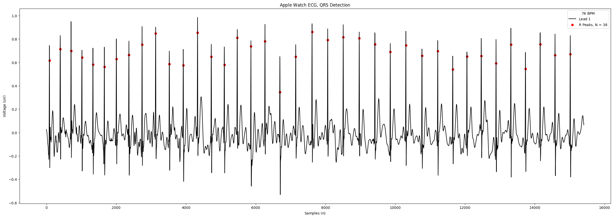
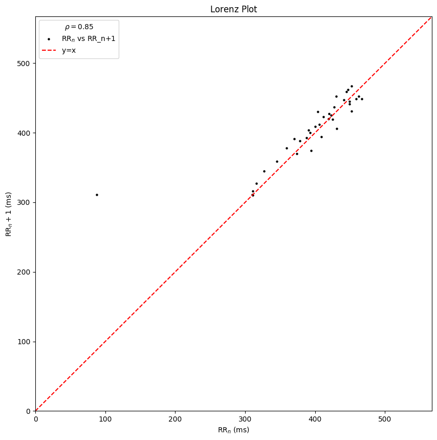

# Dynamic ECG

[](https://www.python.org/downloads/release/python-3112/)
[](https://www.gnu.org/licenses/gpl-3.0.en.html)

## Description
This package is a collection of tools for processing and detecting waveforms within ECG data. It aims to output the indexes of the P, QRS, and T waves within an ECG signal. It's defitnelty a work in progress, but it's a start.
## Table of Contents

- [Installation](#installation)
- [Usage](#usage)
- [Contributing](#contributing)
- [License](#license)

## Example
### Loading Apple Watch ECG Data
Once you have exported your data dump from health, you can load your ecg csv. The example below uses the sample data.
```python
import data_utils as data
apple_watch_ecg = data.ecg_data(file_path='../data/ecg_2021-12-17.csv')
apple_watch_ecg.lead_1.r_plot()
```
#### Output
```
Signal not too long, not slicing
Execution time for grad_sqaure_conv: 0.0005929470062255859 seconds
Execution time for threshold_calc: 5.507469177246094e-05 seconds
Execution time for peak: 9.703636169433594e-05 seconds
Execution time for r_wave_detector: 0.0007870197296142578 seconds
Execution time for threshold_calc: 3.314018249511719e-05 seconds
Execution time for peak: 6.985664367675781e-05 seconds
Execution time for p_wave_detector: 0.000247955322265625 seconds
Execution time for calculate_rr_int: 2.3126602172851562e-05 seconds
```
#### R plot

#### Lorenz plot



## Feautres
- R peak detection
- BPM Measurement
- Lorenz Plot

## Feautres to be added 
- [ ] P wave detection
- [ ] T Wave detection


## Usage

## Contributing


## License

